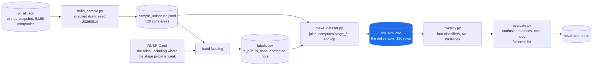

# ICP benchmark - 120 real YC companies, hand-labeled

A labeled evaluation set and a scoring harness for the question "is this inbound lead
actually our ICP?", where ICP is **YC-backed, Series A to C, B2B SaaS**.

The point is not the classifier. The point is that you cannot tune an ICP filter you
have never measured, and measuring it requires a labeled set with hard negatives in it.

---

## The short version

**What I noticed.** Tools that score whether a company matches an ideal customer profile
ship without any measurement of how often they are right, because building the labeled set
is the tedious part. So I built the labeled set.

**How.** 120 real companies from the free YC OSS API, hand-labeled on three axes (B2B, SaaS,
stage) against a rubric I wrote before scoring anything. The classifier only sees what a form
fill plus enrichment would give you, never the descriptive text I labeled from, so the
evaluation cannot leak its own answer. 21 of the 120 are deliberately borderline.

**What I found.**

| classifier | precision | recall | F1 | enrichment calls | ICP found |
|---|---:|---:|---:|---:|---:|
| enrich everything | 0.250 | 1.000 | 0.400 | 120 | 30 of 30 |
| industry tag only | 0.400 | 1.000 | 0.571 | 75 | 30 of 30 |
| keyword rules | **0.938** | 0.500 | 0.652 | 16 | 15 of 30 |
| rules v2 (one rule inverted) | 0.829 | **0.967** | **0.892** | 35 | **29 of 30** |

A keyword filter over taglines is precise and half-blind. It finds 15 of the 30 real ICP
companies and is right about almost everything it does flag. **Inverting a single rule takes
recall from 0.500 to 0.967 while still cutting enrichment calls 70.8%**, so you find 29 of 30
instead of 15 of 30 and still pay for a third of the lookups.

At an assumed $0.10 per enrichment call, that is **$0.121 per resolved ICP lead against $0.400
if you enrich everything.** The unit cost is an input I sweep rather than assert, since I do
not know what you pay.

**The finding I did not expect.** Going in, I assumed the stage proxy would be the weak axis,
since inferring Series A to C from public signals is genuinely hard. It is not. `stage_fit`
scores F1 0.824. **`is_saas` is the weakest axis at F1 0.632**, and every false positive is a
B2B services business whose tagline reads like software. inDinero's "Financial dashboard for
businesses" bundles human CPAs. That is the class of error worth designing around, and it is
invisible without hard negatives in the set.

**What it is not.** 120 rows is enough to separate these classifiers and not enough to
certify a production filter. The ICP definition (YC-backed, Series A to C, B2B SaaS) is my
reading of a public description, so if that is not the real target, the labels move and the
numbers move with them.

## What is in here

| file | what it is |
|---|---|
| `yc_all.json` | pinned snapshot of the free YC OSS API, fetched 2026-08-14 (6,168 companies) |
| `build_sample.py` | deterministic stratified draw of 120 companies (seed 20260814) |
| `labels.csv` | the hand labels: `is_b2b`, `is_saas`, `borderline`, and a note per row |
| `RUBRIC.md` | the labeling rules, including exactly where the stage proxy is weak |
| `make_dataset.py` | joins sample + labels, computes `stage_fit` and `icp`, emits `icp_eval.csv` |
| `icp_eval.csv` | **the deliverable**: 120 labeled rows |
| `classify.py` | four classifiers, two of them baselines |
| `evaluate.py` | metrics, confusion matrices, cost model, full error list |
| `results/report.txt` | committed output of the command below |

## The pipeline



The snapshot is pinned on purpose. The live YC API changes, so re-fetching would
silently change which 120 companies you drew and make the labels meaningless.

## Reproduce

From this directory, with system `python3` (3.14 here; stdlib only, no dependencies):

```bash
python3 build_sample.py --raw yc_all.json --out sample_unlabeled.jsonl
python3 make_dataset.py
python3 evaluate.py > results/report.txt
```

Byte-identical on repeat runs. `yc_all.json` is pinned on purpose: the live API changes,
and re-fetching it would silently change which 120 companies you get.

To point this at your own data, replace `icp_eval.csv` with the same columns. To change
the ICP definition, edit the `stage_fit` rule in `make_dataset.py` and re-label.

## Where the data came from

Every row is a real company. Nothing is generated.

- **Companies, taglines, industries, headcount, batch, status, YC stage:** the free
  public YC OSS API, `https://yc-oss.github.io/api/companies/all.json`, fetched
  2026-08-14. No key, no paid tier, no scraping.
- **`is_b2b` and `is_saas`:** assigned by hand, one row at a time, by reading each
  company's `long_description` against `RUBRIC.md`. Each row carries its own
  `label_note` explaining the call.
- **`stage_fit`:** computed, not hand-entered, from `status == "Active" AND yc_stage ==
  "Growth"`. This is a **proxy** for "Series A to C", not a funding-round label. No free
  source gives a reliable Series letter for 120 companies. `RUBRIC.md` says where it is
  wrong.

21 of 120 rows are flagged `borderline`. They are kept and scored normally, and also
reported as a separate slice, because dropping hard cases buys a precision you did not
earn.

## The one design decision that matters

The labeler reads the full `long_description`, `tags`, `subindustry`, and YC stage flag.
The classifier is given only `one_liner`, top-level `industries`, `team_size`, `batch`,
and `website` - roughly what a real inbound pipeline holds after a form fill plus
firmographic enrichment.

Without that gap the benchmark would be circular and every F1 in it would be a
restatement of the labeling rule.

## Headline result

See `results/report.txt` for the full tables. The short version: a plain keyword filter is
precise and half-blind (P 0.938 / R 0.500), and the axis that breaks it is not the stage
proxy, it is deciding whether a company is really SaaS. Fourteen of its fifteen misses
are B2B SaaS companies whose taglines never say "software", "platform", or "SaaS".

`rules_v2` was written **after** reading those errors, so its numbers are in-sample and
are an upper bound, not a held-out estimate. At n=120 with 30 positives there is not
enough data to hold out a meaningful test split, and that is stated rather than hidden.
